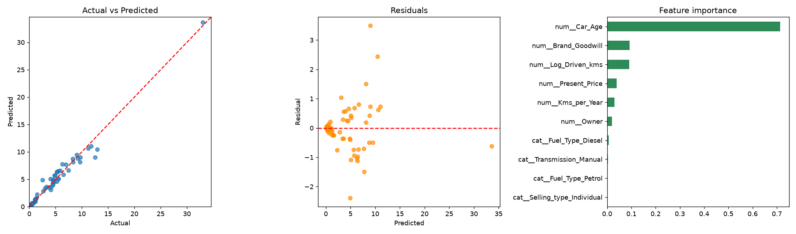

# Car Price Prediction

A regression project that predicts the resale price of used cars from features such as present price, age, kilometres driven, fuel type, transmission and brand.

## Dataset

301 used-car listings (prices in lakhs). Columns: `Car_Name`, `Year`, `Selling_Price`, `Present_Price`, `Driven_kms`, `Fuel_Type`, `Selling_type`, `Transmission`, `Owner`.

## Workflow

1. **Data cleaning:** removed duplicate rows and checked for missing values.
2. **EDA:** price distribution, correlations, price by fuel type and transmission.
3. **Feature engineering:** car age, kilometres per year, log of kilometres driven, and brand goodwill (smoothed average resale ratio per brand, computed on the training set only to avoid data leakage).
4. **Preprocessing:** StandardScaler for numeric features and OneHotEncoder for categorical features, inside a scikit-learn Pipeline.
5. **Modeling:** Linear Regression, Ridge, Random Forest and Gradient Boosting, compared with 5-fold cross-validation.
6. **Tuning:** GridSearchCV on Gradient Boosting.
7. **Evaluation:** R2, MAE, RMSE, residual analysis and feature importance.

## Key design decision

Predicting `Selling_Price` directly made tree-based models fail on expensive cars outside the training price range (Random Forest test R2 dropped to 0.48). The final model predicts `log(Selling_Price / Present_Price)` and multiplies the result back by the present price. This raised the test R2 to about 0.97.

## Results (test set)

| Model | R2 | MAE (lakhs) |
|---|---|---|
| Gradient Boosting (tuned) | 0.972 | 0.55 |
| Linear Regression | 0.970 | 0.57 |
| Ridge | 0.970 | 0.58 |
| Random Forest | 0.960 | 0.63 |

Most important features: car age, brand goodwill, kilometres driven.



## Project structure

```
car-price-prediction/
├── README.md
├── requirements.txt
├── data/
│   └── car_data.csv
├── notebooks/
│   └── car_price_prediction.ipynb
├── models/
│   └── car_price_model.joblib
└── images/
    ├── eda_plots.png
    └── model_evaluation.png
```

## How to run

```bash
pip install -r requirements.txt
jupyter notebook notebooks/car_price_prediction.ipynb
```

## Real-world applications

Price prediction models like this one are used by used-car marketplaces to suggest listing prices, by dealers to price trade-ins, and by buyers to check whether an offer is fair.

## Limitations

- Small dataset (about 300 rows), so results vary slightly with the train/test split.
- No horsepower or engine-size features in this dataset.
- Prices come from a single market and time period.

## Tools

Python, Pandas, NumPy, Scikit-learn, Matplotlib
